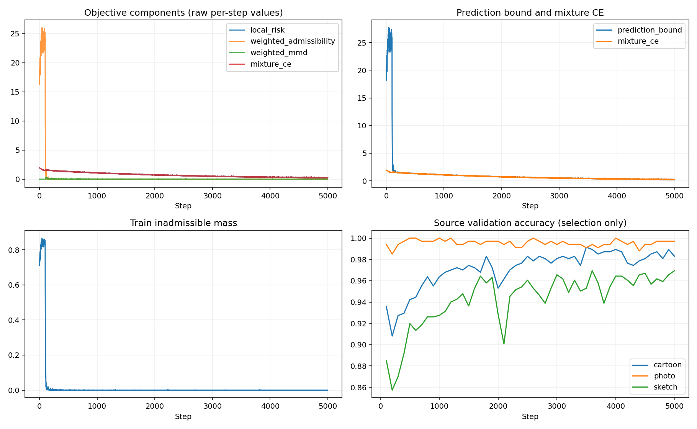
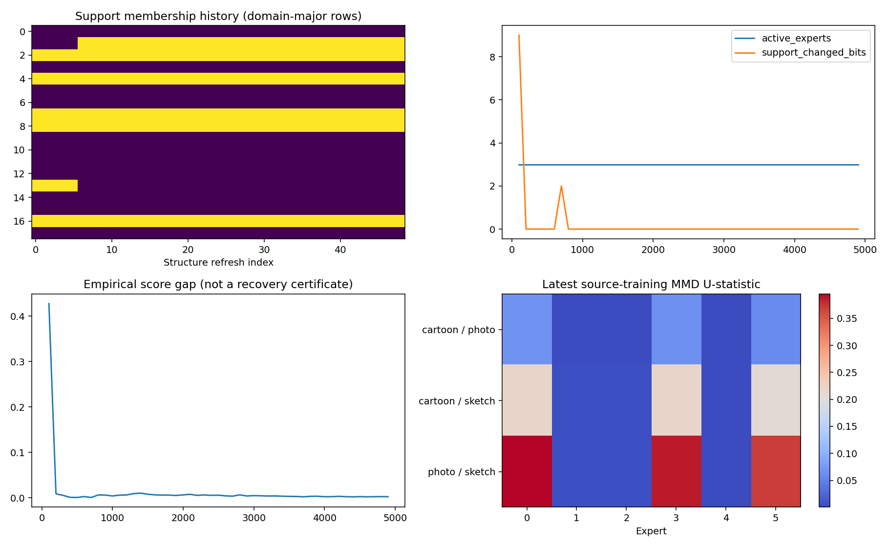
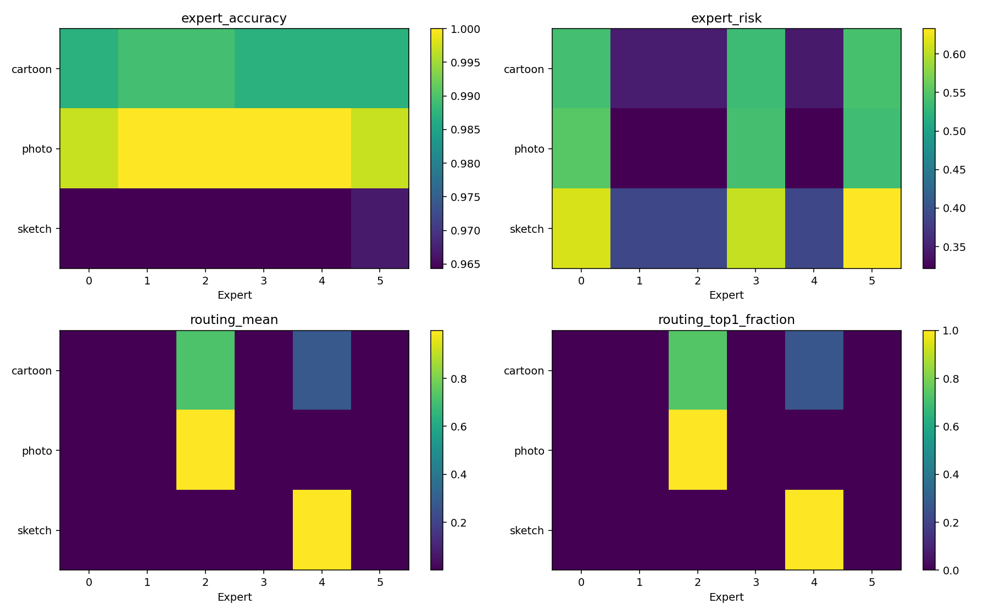
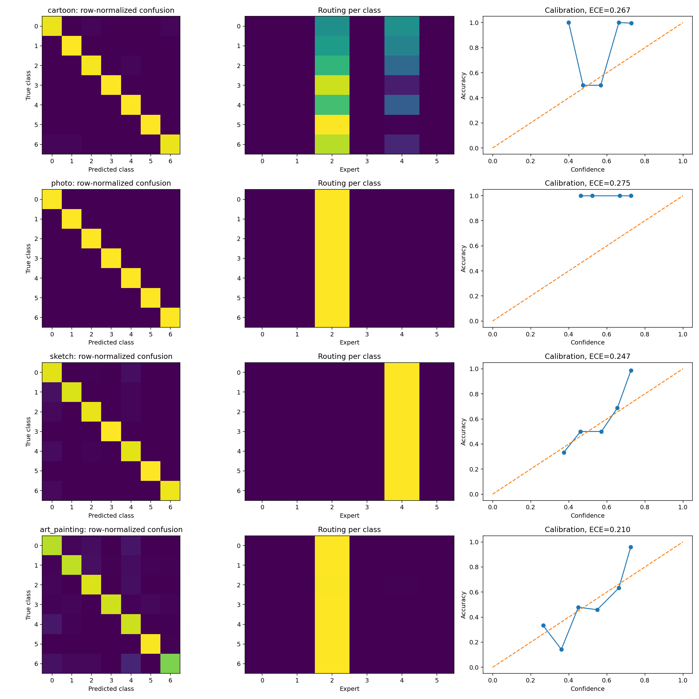
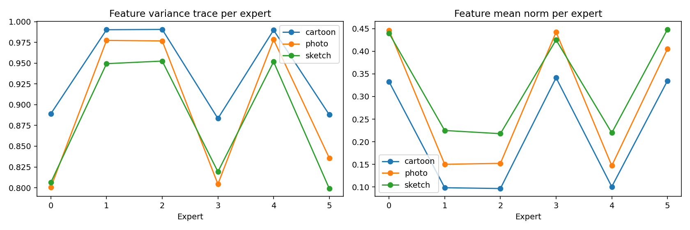

# PACS support EDA — target art_painting

Status: completed; latest step 5000/5000; seed 0.

Source domains: cartoon, photo, sketch.
Class indices: 0=dog, 1=elephant, 2=giraffe, 3=guitar, 4=horse, 5=house, 6=person.

Checkpoint selection uses mean source-validation accuracy. Target statistics appear only after selection.

MMD estimates may be negative. Empirical candidate gaps are probe-specific, not population separation guarantees. Feature statistics and routing utilization are diagnostics, not new losses.

Best source accuracy: 0.9845; selected step: 4000.
Target accuracy: 0.9033.

